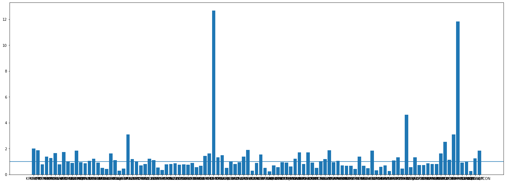

# 업비트 API
- 업비트 API는 `REST API`(http 기반으로 데이터에 접근하는 방식)으로 두가지로 나뉜다
- Quatatiom API : 본인 인증 없이 시세, 호가 등 조회가능
- Exchange API : 본인 인증 후 주문, 출금, 입금 관련된 API


```python
# 마켓코드 조회
import requests

url = "https://api`.upbit.com/v1/market/all"
querystring = {"isDetails":"false"}
response = requests.request("GET", url, params=querystring)

# print(response.text)
```

# 1. pyupbit 설치


```python
# 원화로 거래 가능한 코인 조회
resp = requests.get(url)
data = resp.json()

krw_tickers = []
for coin in data :
    ticker = coin['market']
    
    if ticker.startswith("KRW") : 
        krw_tickers.append(ticker)
```

# 2. 티커 조회


```python
import pyupbit

tickers = pyupbit.get_tickers(fiat="KRW")
print(tickers)
```

    ['KRW-BTC', 'KRW-ETH', 'KRW-NEO', 'KRW-MTL', 'KRW-LTC', 'KRW-XRP', 'KRW-ETC', 'KRW-OMG', 'KRW-SNT', 'KRW-WAVES', 'KRW-XEM', 'KRW-QTUM', 'KRW-LSK', 'KRW-STEEM', 'KRW-XLM', 'KRW-ARDR', 'KRW-KMD', 'KRW-ARK', 'KRW-STORJ', 'KRW-GRS', 'KRW-REP', 'KRW-EMC2', 'KRW-ADA', 'KRW-SBD', 'KRW-POWR', 'KRW-BTG', 'KRW-ICX', 'KRW-EOS', 'KRW-TRX', 'KRW-SC', 'KRW-IGNIS', 'KRW-ONT', 'KRW-ZIL', 'KRW-POLY', 'KRW-ZRX', 'KRW-SRN', 'KRW-LOOM', 'KRW-BCH', 'KRW-ADX', 'KRW-BAT', 'KRW-IOST', 'KRW-DMT', 'KRW-RFR', 'KRW-CVC', 'KRW-IQ', 'KRW-IOTA', 'KRW-MFT', 'KRW-ONG', 'KRW-GAS', 'KRW-UPP', 'KRW-ELF', 'KRW-KNC', 'KRW-BSV', 'KRW-THETA', 'KRW-EDR', 'KRW-QKC', 'KRW-BTT', 'KRW-MOC', 'KRW-ENJ', 'KRW-TFUEL', 'KRW-MANA', 'KRW-ANKR', 'KRW-NPXS', 'KRW-AERGO', 'KRW-ATOM', 'KRW-TT', 'KRW-CRE', 'KRW-SOLVE', 'KRW-MBL', 'KRW-TSHP', 'KRW-WAXP', 'KRW-HBAR', 'KRW-MED', 'KRW-MLK', 'KRW-STPT', 'KRW-ORBS', 'KRW-VET', 'KRW-CHZ', 'KRW-PXL', 'KRW-STMX', 'KRW-DKA', 'KRW-HIVE', 'KRW-KAVA', 'KRW-AHT', 'KRW-SPND', 'KRW-LINK', 'KRW-XTZ', 'KRW-BORA', 'KRW-JST', 'KRW-CRO', 'KRW-TON', 'KRW-SXP', 'KRW-LAMB', 'KRW-HUNT', 'KRW-MARO', 'KRW-PLA', 'KRW-DOT', 'KRW-SRM', 'KRW-MVL', 'KRW-PCI', 'KRW-STRAX', 'KRW-AQT', 'KRW-BCHA', 'KRW-GLM', 'KRW-QTCON', 'KRW-SSX', 'KRW-META', 'KRW-OBSR', 'KRW-FCT2', 'KRW-LBC', 'KRW-CBK', 'KRW-SAND', 'KRW-HUM', 'KRW-DOGE']
    

# 3. 현재가 조회


```python
price = pyupbit.get_current_price("KRW-XRP")
print(price)
```

    484.0
    


```python
price = pyupbit.get_current_price(["BTC-XRP", "KRW-XRP"])
print(price)
```

    {'BTC-XRP': 9.35e-06, 'KRW-XRP': 484.0}
    

# 4. 과거 데이터 조회


```python
df = pyupbit.get_ohlcv("KRW-BTC")
print(df)
```

                               open        high         low       close  \
    2020-08-13 09:00:00  13708000.0  13890000.0  13398000.0  13810000.0   
    2020-08-14 09:00:00  13810000.0  13939000.0  13706000.0  13846000.0   
    2020-08-15 09:00:00  13845000.0  14051000.0  13796000.0  13878000.0   
    2020-08-16 09:00:00  13867000.0  13962000.0  13751000.0  13889000.0   
    2020-08-17 09:00:00  13889000.0  14382000.0  13809000.0  14204000.0   
    ...                         ...         ...         ...         ...   
    2021-02-24 09:00:00  55106000.0  58150000.0  52875000.0  56500000.0   
    2021-02-25 09:00:00  56501000.0  58890000.0  53800000.0  54168000.0   
    2021-02-26 09:00:00  54128000.0  55226000.0  51809000.0  53804000.0   
    2021-02-27 09:00:00  53835000.0  55579000.0  52780000.0  53494000.0   
    2021-02-28 09:00:00  53494000.0  54098000.0  51300000.0  52124000.0   
    
                               volume  
    2020-08-13 09:00:00   6509.120091  
    2020-08-14 09:00:00   5427.795611  
    2020-08-15 09:00:00   3784.706795  
    2020-08-16 09:00:00   2621.220263  
    2020-08-17 09:00:00   7068.798724  
    ...                           ...  
    2021-02-24 09:00:00  19006.411125  
    2021-02-25 09:00:00  15921.350587  
    2021-02-26 09:00:00  13302.347430  
    2021-02-27 09:00:00   7402.628448  
    2021-02-28 09:00:00   4705.561500  
    
    [200 rows x 5 columns]
    

# 5. 호가 조회


```python
orderbook = pyupbit.get_orderbook("KRW-BTC")
print(orderbook)
```

    [{'market': 'KRW-BTC', 'timestamp': 1614499565162, 'total_ask_size': 2.65059135, 'total_bid_size': 1.47619062, 'orderbook_units': [{'ask_price': 52041000.0, 'bid_price': 52029000.0, 'ask_size': 0.21243406, 'bid_size': 0.00414928}, {'ask_price': 52044000.0, 'bid_price': 52015000.0, 'ask_size': 0.1115628, 'bid_size': 0.00364947}, {'ask_price': 52066000.0, 'bid_price': 52014000.0, 'ask_size': 1.1813, 'bid_size': 0.00576767}, {'ask_price': 52089000.0, 'bid_price': 52013000.0, 'ask_size': 0.00914764, 'bid_size': 0.03089721}, {'ask_price': 52090000.0, 'bid_price': 52012000.0, 'ask_size': 0.0134892, 'bid_size': 0.00939031}, {'ask_price': 52100000.0, 'bid_price': 52011000.0, 'ask_size': 0.1919, 'bid_size': 0.01920781}, {'ask_price': 52104000.0, 'bid_price': 52000000.0, 'ask_size': 0.41694435, 'bid_size': 0.01587495}, {'ask_price': 52106000.0, 'bid_price': 51999000.0, 'ask_size': 0.00909453, 'bid_size': 0.02085608}, {'ask_price': 52108000.0, 'bid_price': 51973000.0, 'ask_size': 0.00433808, 'bid_size': 0.00964099}, {'ask_price': 52109000.0, 'bid_price': 51972000.0, 'ask_size': 0.0355095, 'bid_size': 1.171682}, {'ask_price': 52112000.0, 'bid_price': 51969000.0, 'ask_size': 0.34610687, 'bid_size': 0.07681525}, {'ask_price': 52113000.0, 'bid_price': 51960000.0, 'ask_size': 0.00803786, 'bid_size': 0.03001785}, {'ask_price': 52115000.0, 'bid_price': 51955000.0, 'ask_size': 0.00029227, 'bid_size': 0.00019247}, {'ask_price': 52116000.0, 'bid_price': 51954000.0, 'ask_size': 0.10214696, 'bid_size': 0.0778568}, {'ask_price': 52118000.0, 'bid_price': 51953000.0, 'ask_size': 0.00828723, 'bid_size': 0.00019248}]}]
    


```python
orderbook = pyupbit.get_orderbook("KRW-BTC")
bids_asks = orderbook[0]['orderbook_units']

for bid_ask in bids_asks:
    print(bid_ask)
```

    {'ask_price': 51972000.0, 'bid_price': 51960000.0, 'ask_size': 0.30334773, 'bid_size': 0.00710035}
    {'ask_price': 51994000.0, 'bid_price': 51927000.0, 'ask_size': 0.02183635, 'bid_size': 0.00019935}
    {'ask_price': 51997000.0, 'bid_price': 51925000.0, 'ask_size': 0.09698495, 'bid_size': 0.01861695}
    {'ask_price': 51999000.0, 'bid_price': 51921000.0, 'ask_size': 0.03852319, 'bid_size': 0.01933688}
    {'ask_price': 52013000.0, 'bid_price': 51919000.0, 'ask_size': 0.00094217, 'bid_size': 0.00014436}
    {'ask_price': 52040000.0, 'bid_price': 51917000.0, 'ask_size': 0.03233623, 'bid_size': 0.02936818}
    {'ask_price': 52041000.0, 'bid_price': 51914000.0, 'ask_size': 0.00215088, 'bid_size': 2.20772493}
    {'ask_price': 52049000.0, 'bid_price': 51913000.0, 'ask_size': 0.02, 'bid_size': 0.00064998}
    {'ask_price': 52083000.0, 'bid_price': 51912000.0, 'ask_size': 0.00019201, 'bid_size': 0.03109093}
    {'ask_price': 52090000.0, 'bid_price': 51910000.0, 'ask_size': 0.0134892, 'bid_size': 0.0008}
    {'ask_price': 52106000.0, 'bid_price': 51908000.0, 'ask_size': 0.00909453, 'bid_size': 0.00228914}
    {'ask_price': 52109000.0, 'bid_price': 51903000.0, 'ask_size': 0.16293026, 'bid_size': 0.00520172}
    {'ask_price': 52113000.0, 'bid_price': 51900000.0, 'ask_size': 0.00803786, 'bid_size': 0.24268433}
    {'ask_price': 52116000.0, 'bid_price': 51896000.0, 'ask_size': 0.02480127, 'bid_size': 0.1862}
    {'ask_price': 52118000.0, 'bid_price': 51890000.0, 'ask_size': 0.0106876, 'bid_size': 0.00336486}
    

# 6. 매수/매도


```python
upbit = pyupbit.Upbit(access_key, secret_key)
ret = upbit.buy_limit_order("KRW-XRP", 100, 20)
print(ret)
```


```python
upbit = pyupbit.Upbit(access_key, secret_key)
ret = upbit.sell_limit_order("KRW-XRP", 1000, 20)
print(ret)
```

# 7. 주문 취소


```python
upbit = pyupbit.Upbit(access_key, secret_key)
ret = upbit.cancel_order('cc52be46-1000-4126-aee7-9bfafb867682')
print(ret)
```

# 8. 변동성 돌파 전략
`Range` = 고가 - 저가  
`목표가` = 당일 시가 + 전날의 레인지 * 0.5  
`매수여부` = **거래일의 고가 >= 목표가** 이면 매수

## 8.1. 백테스팅 


```python
import pandas as pd
pd.set_option('mode.chained_assignment',  None) # 무시

def backtesting(ticker, days, sign) :     
    df = pyupbit.get_ohlcv(ticker, count = days)
    # range, 목표가 설정
    df['range'] = df['high'] - df['low']
    df['목표가'] = df['open'] + df["range"].shift(1) * sign
    df = df.fillna(0)

    # 매수여부 계산
    df['매수여부'] = ''
    for i in range(len(df)) :
        if df['high'][i] >= df['목표가'][i] :
            df['매수여부'][i] = 1
        else :
            df['매수여부'][i] = 0   
    
    # 첫날은 예외
    df['목표가'][0] = df['목표가'][1]

    # 당일 수익률 계산        
    df['수익률'] = ''
    for i in range(len(df)) :
        if df['매수여부'][i] == 1 :
            df['수익률'][i] = df['close'][i]/df['목표가'][i]
        else :
            df['수익률'][i] = 1

    # 누적 수익률 계산        
    df['수익률'][0] = 1
    df['수익률'].product()
    
    return df['수익률'].product()
```


```python
# 원화 거래 가능한 티커 조회
def period_revenue(days, sign) :     
    tickers = pyupbit.get_tickers(fiat="KRW")[:99]
    revenue = dict() 
    error_ticker = []

    for ticker in tickers :
        try : 
            revenue[ticker] = round(backtesting(ticker, days, sign), 2)
        except TypeError :
            error_ticker.append(ticker)
            pass 
        
    ratio = pd.DataFrame({"ratio" : revenue.values()})

    print("총 원화거래 가능한 코인 수 : {}".format(len(tickers))),
    print("수익률 계산 가능한 코인 수 : {}".format(len(revenue))),
    print("총 누적 수익률 : {}".format(round(sum(list(revenue.values()))/len(revenue),3))),
    print("수익률 계산 불가능한 코인 : {}".format(error_ticker)),
    print("원금 회수 불가 코인 수 : {}".format(len(ratio[ratio['ratio']<1])))
```


```python
# period_revenue(30, 0.5)
period_revenue(200, 0.5)
```

    총 원화거래 가능한 코인 수 : 99
    수익률 계산 가능한 코인 수 : 99
    총 누적 수익률 : 1.187
    수익률 계산 불가능한 코인 : []
    원금 회수 불가 코인 수 : 56
    


```python
# 원화 거래 가능한 시총 상위 10 코입 티커 조회
def top_period_revenue(days, sign) :     
    tickers = ['KRW-BTC', 'KRW-ETH', 'KRW-ADA', 'KRW-XRP','KRW-DCT','KRW-LTC', 'KRW-LINK', 'KRW-XLM', 'KRW-BCH', 'KRW-DOGE']
    revenue = dict() 
    error_ticker = []

    for ticker in tickers :
        try : 
            revenue[ticker] = round(backtesting(ticker, days, sign), 2)
        except TypeError :
            error_ticker.append(ticker)
            pass 
        
    ratio = pd.DataFrame({"ratio" : revenue.values()})

    print("총 원화거래 가능한 코인 수 : {}".format(len(tickers))),
    print("수익률 계산 가능한 코인 수 : {}".format(len(revenue))),
    print("수익률 계산 불가능한 코인 : {}".format(error_ticker)),
    print("총 누적 수익률 : {}".format(round(sum(list(revenue.values()))/len(revenue),3))),    
    print("원금 회수 불가 코인 수 : {}".format(len(ratio[ratio['ratio']<1])))
```


```python
top_period_revenue(200, 0.5)
```

    TypeError
    It failed JSONDecodeError
    TypeError
    총 원화거래 가능한 코인 수 : 10
    수익률 계산 가능한 코인 수 : 8
    수익률 계산 불가능한 코인 : ['KRW-DCT', 'KRW-BCH']
    총 누적 수익률 : 1.68
    원금 회수 불가 코인 수 : 0
    


```python
top_period_revenue(21, 0.5)
```

    TypeError
    총 원화거래 가능한 코인 수 : 10
    수익률 계산 가능한 코인 수 : 9
    수익률 계산 불가능한 코인 : ['KRW-DCT']
    총 누적 수익률 : 1.073
    원금 회수 불가 코인 수 : 3
    


```python
plt.figure(figsize=(25, 9))
plt.bar(revenue.keys(), revenue.values())
plt.axhline(y=1)
plt.show()
```


    

    

